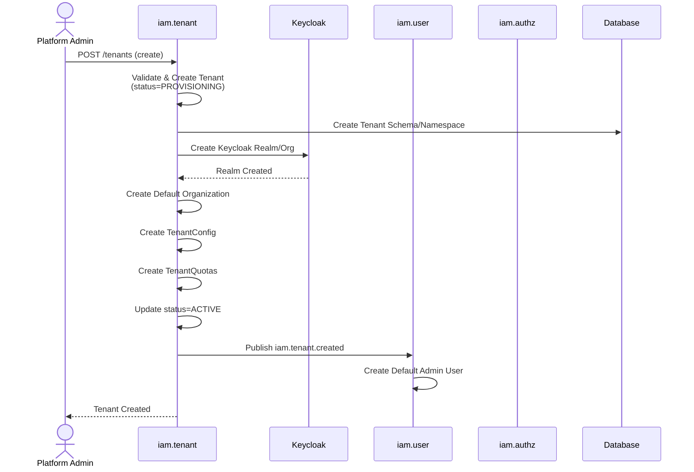
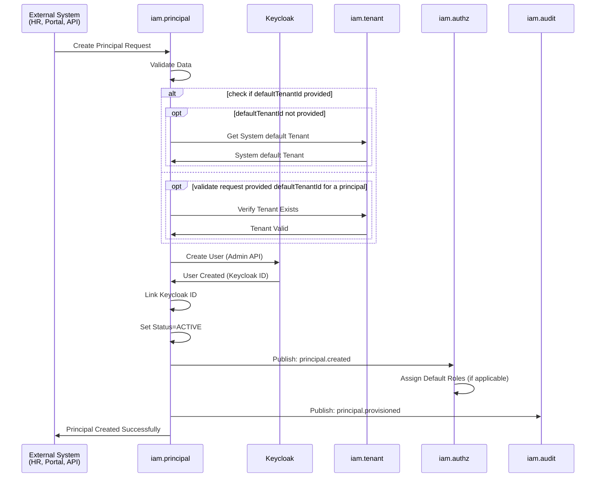
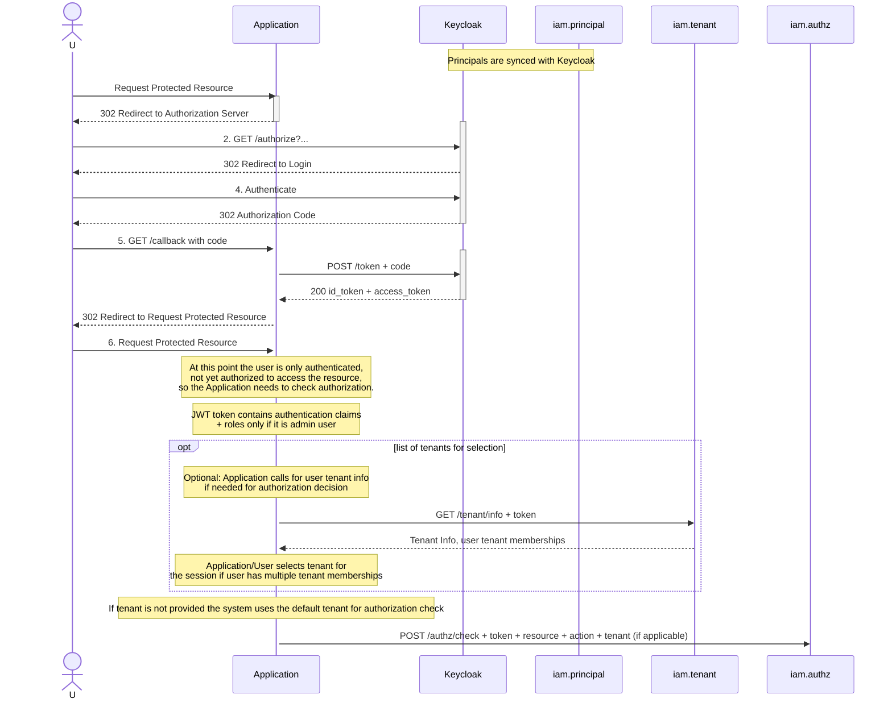

# IAM core concepts

<!-- TOC -->

* [IAM core concepts](#iam-core-concepts)
    * [Roles and responsibilities](#roles-and-responsibilities)
    * [Tenant creation and provisioning](#tenant-creation-and-provisioning)
    * [Principal creation and provisioning](#principal-creation-and-provisioning)
    * [Authentication and authorization flow](#authentication-and-authorization-flow)

<!-- TOC -->

## Roles and responsibilities

General domain and conceptual rules:

1. Authentication and Authorization are separate concerns!
2. `iam.principal` is the core domain representing an identity in the system used for authentication.
3. `iam.authz` is the core domain representing authorization policies and roles used for authorization.
4. `iam.tenant`  is the core domain representing a tenant (organization) in the system.
5. `iam.audit` logs all significant actions for compliance and monitoring.

Decoupling domain rules:

1. principal can be created without any authorization roles assigned, without any tenant assigned.
2. tenant can be created without any principals assigned.
3. authorization roles can be created without any principals assigned.
4. authorization roles can be created without any tenants assigned.

## Tenant creation and provisioning

On the tenant domain we have a `default` tenant that represents and holds all principals that does not provide the
default tenant on principal creation. When creating a principal there is `defaultTenantId` and it is optional. When a
new
tenant is created, the following sequence of events occurs:

## Principal creation and provisioning

When a new principal is created, the following sequence of events occurs:

The idea behind `defaultTenantId` making it optional is to provide a more convenient way to onboard new principals into
the system without
requiring the tenant information upfront.

The `defaultTenantId` is only part of this domain again to provide more convenience during principal creation, so that
it is not required to make another call to assign a tenant after the principal is created.

## Authentication and authorization flow

User wants to access some protected resource in the Application. The Application is configured to use Keycloak as
the Authorization Server (AS). The principals are synced with Keycloak. The following sequence diagram illustrates the
authentication and authorization flow:

