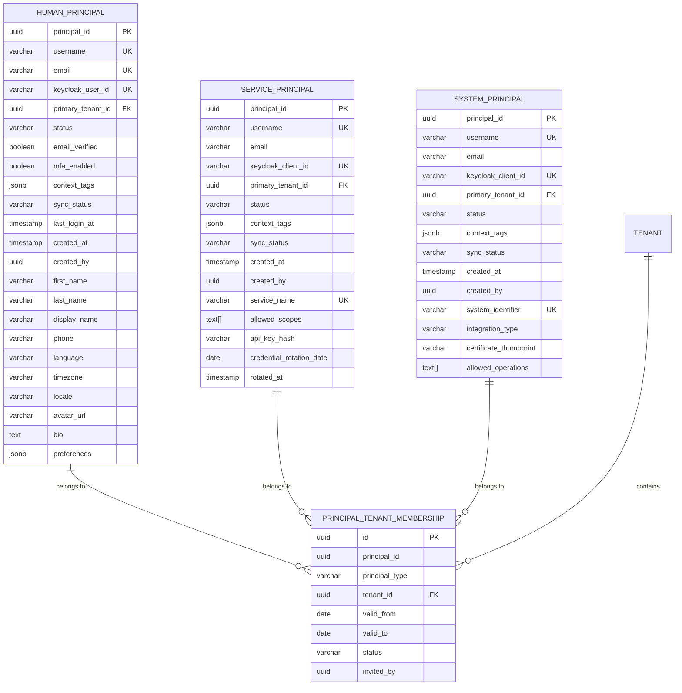

# iam.principal - Principal Management Service Domain Specification

> **Meta Information**
> - **Version:** 2.2
> - **Date:** 2025-12-14
> - **Author(s):** OpenLeap Architecture Team
> - **Status:** APPROVED
> - **Suite:** `iam` (Identity & Access Management)
> - **Domain:** `principal` (Principal Management)
> - **Service ID:** `iam-principal-svc`
> - **basePackage:** `io.openleap.iam.principal`
> - **OpenLeap Starter Version:** `1.2.6-SNAPSHOT`
> - **Port:** `8080`
> - **Change Summary:** Added DevicePrincipal, membership events, cross-tenant use cases, basePackage; Clarified abstract Principal pattern

---

## 0. Document Purpose & Scope

### 0.1 Purpose
This document specifies the Principal Management Service domain within the IAM Suite. It defines principal lifecycle management, authentication coordination, and identity management for all authenticated entities (humans, services, systems) across the OpenLeap platform.

**Core Responsibility:** Manage identity and authentication for all principals. Business domains reference principals; IAM does NOT reference business entities.

### 0.2 Target Audience
- System Architects & Technical Leads
- Platform Administrators
- Security Officers
- Service Developers integrating with IAM
- Compliance Officers

### 0.3 Scope

**In Scope:**
- Principal lifecycle management (create, activate, suspend, deactivate, delete)
- Principal identity attributes (username, email, display name)
- Keycloak synchronization for authentication
- Principal type management (HUMAN, SERVICE, SYSTEM, DEVICE)
- Service/system credential management (API keys, certificates)
- Profile management for human principals
- Multi-tenant principal membership
- Principal search and directory services
- GDPR-compliant data handling

**Out of Scope:**
- Authentication (handled by Keycloak)
- OAuth2 token issuance (handled by Keycloak)
- Authorization and permissions (see iam.authz)
- Tenant administration (see iam.tenant)
- Business domain data (employees, customers, contracts, etc.)
- Audit logging (see iam.audit)

### 0.4 Related Documents
- `_iam_suite.md` - IAM Suite Architecture Overview
- `iam_authz_spec.md` - Authorization Service
- `iam_tenant_spec.md` - Tenant Management Service
- `iam_audit_spec.md` - Audit Service
- `SYSTEM_OVERVIEW.md` - Platform architecture overview

---

## 1. Business Context

### 1.1 Domain Purpose

The Principal Management Service is the **system of record for all authenticated entities** within the OpenLeap platform. It provides:

1. **Identity Management:** Centralized principal identity across all business domains
2. **Authentication Coordination:** Bridge between platform and Keycloak authentication
3. **Principal Lifecycle:** Create, activate, suspend, deactivate, and delete principals
4. **Multi-Type Support:** Humans, services, systems, and devices
5. **Domain-Agnostic Design:** No knowledge of business context (employees, customers, etc.)

**Key Architectural Principle:**
```
Business Domains (HR, BP, Sales, etc.)
        ↓
    store principal_id as FK
        ↓
    IAM.Principal (this domain)
        ↓
    provides authentication & identity
```

**NOT:**
```
IAM.Principal
    ↓ references (WRONG!)
Business Domains
```

### 1.2 Business Value

- **Single Source of Truth:** One place for all principal identities
- **Domain-Agnostic:** Works with any business context (manufacturing, retail, education, healthcare, finance)
- **Multi-Principal Support:** Humans, services, systems, devices
- **Scalable:** Supports millions of principals across thousands of tenants
- **Compliant:** GDPR-ready principal data handling
- **Extensible:** Easy to add new principal types or authentication methods

### 1.3 Key Stakeholders

| Role | Responsibility | Primary Use Cases |
|------|----------------|-------------------|
| Platform Administrator | System-wide principal management | Create service principals, manage system access |
| Tenant Administrator | Tenant-scoped principal management | Create human principals, manage tenant membership |
| Human Principal (End User) | Self-service profile management | Update profile, change password (via Keycloak) |
| System Integrator | Configure system principals | Set up API integrations, manage credentials |
| Compliance Officer | Principal data governance | Handle GDPR requests, audit principal data |
| Service Developer | Integrate services with IAM | Create principals via API, query principal info |

### 1.4 Strategic Positioning


**Integration Pattern:**
1. Business domains call `POST /api/iam/principal/v1/principals` to create principals
2. IAM returns `principal_id`
3. Business domains store `principal_id` as foreign key in their entities
4. IAM publishes events that business domains consume for cache updates
5. Business domains NEVER query IAM for business context (job title, customer status, etc.)

---

## 2. Domain Model

### 2.1 Conceptual Overview

The Principal domain models all authenticated entities using a **class hierarchy with table-per-class persistence**:

- **Principal (Abstract):** Base class with universal identity attributes (username, email, status) - NOT persisted directly
- **HumanPrincipal:** Concrete class for human users, includes profile attributes
- **ServicePrincipal:** Concrete class for microservices and internal applications
- **SystemPrincipal:** Concrete class for external systems and integrations
- **Tenant Membership:** Multi-tenant access control (shared across all principal types)
- **Keycloak Sync:** Authentication system synchronization

**Inheritance Model:**
```
Principal (abstract)
├── HumanPrincipal    → human_principals table
├── ServicePrincipal  → service_principals table
└── SystemPrincipal   → system_principals table
```

**Persistence Strategy: Table-Per-Class**
Each concrete principal type has its own complete table containing:
- All inherited attributes from abstract Principal
- Type-specific attributes unique to that principal type
- No shared base table, no FK relationships between principal tables

**Design Principles:**
1. **Separation of Concerns:** Identity in IAM, business context in business domains
2. **Type-Specific Tables:** Each principal type has its own complete table (table-per-class)
3. **No Shared Base Table:** Principal is abstract; only concrete subclasses are persisted
4. **Lightweight Classification:** Optional `context_tags` for minimal business hints
5. **Immutable Identity:** Username cannot change after creation; type is implicit from table

### 2.2 Entity Relationship Diagram

**Table-Per-Class Inheritance Model:**

Each concrete principal type is stored in its own complete table. There is no shared base table - Principal is an abstract concept only.



**Note on PRINCIPAL_TENANT_MEMBERSHIP:**
Since there is no shared principal table, the membership table uses a composite reference:
- `principal_id`: The ID of the principal (from any of the three tables)
- `principal_type`: Discriminator indicating which table (`HUMAN`, `SERVICE`, `SYSTEM`)

This allows tenant memberships to reference principals across all three concrete tables.

### 2.3 Aggregate Definitions

#### 2.3.1 Principal (Abstract Base Class)

**Business Purpose:**
Abstract base class representing any authenticated entity that can access the platform. This class is **NOT persisted directly** - only concrete subclasses (HumanPrincipal, ServicePrincipal, SystemPrincipal) are stored in the database.

**Inheritance Model:**
```
Principal (abstract) - NOT a table
├── HumanPrincipal   → human_principals table
├── ServicePrincipal → service_principals table
└── SystemPrincipal  → system_principals table
```

**Inherited Attributes (common to all concrete subclasses):**

| Attribute | Type | Description | Constraints |
|-----------|------|-------------|-------------|
| principal_id | UUID | Unique identifier | PK, immutable, generated |
| username | String | Login username | Globally unique across all principal tables, max 100 chars, lowercase, immutable |
| email | String | Email address | Globally unique (if provided), nullable for SERVICE/SYSTEM |
| primary_tenant_id | UUID | Primary tenant | FK to iam_tenant.tenants |
| status | Enum | Account state | PENDING, ACTIVE, SUSPENDED, INACTIVE, DELETED |
| context_tags | JSONB | Optional business hints | Lightweight classification only, max 10KB |
| sync_status | Enum | Keycloak sync state | PENDING, SYNCING, SYNCED, FAILED |
| created_at | Timestamp | Creation time | Auto-generated |
| created_by | UUID | Creator principal | Nullable |
| updated_at | Timestamp | Last update | Auto-updated |

**Lifecycle States (applies to all concrete subclasses):**


**State Descriptions:**

| State | Meaning | Can Authenticate? | Use Case |
|-------|---------|-------------------|----------|
| PENDING | Just created | ❌ No | Initial creation, awaiting activation |
| ACTIVE | Operational | ✅ Yes | Normal operation |
| SUSPENDED | Temporarily disabled | ❌ No | Security incident, under review |
| INACTIVE | Deactivated | ❌ No | Principal removed from organization |
| DELETED | Purged | ❌ No | GDPR deletion, final state |

**Common Business Rules (inherited by all subclasses):**

| ID | Rule | Validation Point |
|----|------|------------------|
| BR-PRIN-001 | Username must be globally unique across all principal tables | Create |
| BR-PRIN-002 | Username is immutable after creation | Update |
| BR-PRIN-003 | context_tags max size 10KB | Create, Update |
| BR-PRIN-004 | Primary tenant membership must exist and be ACTIVE | Always |
| BR-PRIN-005 | Only ACTIVE principals can authenticate | Authentication |

**Example context_tags:**
```json
{
  "context": "employee",
  "department": "finance",
  "cost_center": "CC-1234"
}
```

**Note:** `context_tags` are for lightweight classification only. Actual business data (job title, salary, customer contracts) belongs in business domains.

**Implementation Note:**
Since `Principal` is an abstract base class, there is **no `PrincipalRepository`** in the implementation. Each concrete subclass has its own repository:
- `HumanPrincipalRepository` for `human_principals` table
- `ServicePrincipalRepository` for `service_principals` table  
- `SystemPrincipalRepository` for `system_principals` table

Operations that work with any principal type (e.g., activate, suspend, deactivate) must determine the concrete type first and delegate to the appropriate repository.

---

#### 2.3.2 HumanPrincipal (Concrete Subclass)

**Business Purpose:**
Concrete subclass of Principal representing human users. Stored in the `human_principals` table with all inherited attributes plus human-specific attributes (profile data is embedded, not in a separate table).

**Persistence:** `iam_principal.human_principals` table

**Inherited Attributes from Principal:**
All attributes from section 2.3.1 are included in this table.

**Human-Specific Attributes:**

| Attribute | Type | Description | Constraints |
|-----------|------|-------------|-------------|
| keycloak_user_id | String | Keycloak user ID | UK, nullable, set after sync |
| email_verified | Boolean | Email verified | Default false |
| mfa_enabled | Boolean | MFA enrolled | Default false |
| last_login_at | Timestamp | Last authentication | Nullable |
| first_name | String | First name | Required, max 100 chars |
| last_name | String | Last name | Required, max 100 chars |
| display_name | String | Preferred display name | Optional, max 200 chars, derived from first_name + last_name if not provided |
| phone | String | Phone number | Optional, E.164 format |
| language | Code | Preferred language | ISO 639-1 (e.g., 'en', 'de') |
| timezone | String | Timezone | IANA timezone (e.g., 'America/New_York') |
| locale | String | Locale | BCP 47 (e.g., 'en-US', 'de-DE') |
| avatar_url | String | Profile picture | DMS reference, max 500 chars |
| bio | Text | Biography | Max 2000 chars |
| preferences | JSONB | UI preferences | Application-specific |

**Business Rules:**

| ID | Rule | Validation Point |
|----|------|------------------|
| BR-HUMAN-001 | Email is required | Create |
| BR-HUMAN-002 | Email must be globally unique | Create, Update |
| BR-HUMAN-003 | keycloak_user_id is immutable after sync | Update |
| BR-HUMAN-004 | display_name is required | Create, Update |
| BR-HUMAN-005 | language must be in supported languages catalog | Create, Update |
| BR-HUMAN-006 | timezone must be valid IANA identifier | Create, Update |
| BR-HUMAN-007 | avatar_url must reference DMS file | Create, Update |

**Example preferences:**
```json
{
  "ui": {
    "theme": "dark",
    "density": "compact",
    "language_override": "de"
  },
  "notifications": {
    "email_enabled": true,
    "push_enabled": false,
    "digest_frequency": "daily"
  },
  "privacy": {
    "profile_visible": false,
    "show_activity": true
  }
}
```

**Authentication:** Via Keycloak user (keycloak_user_id)

---

#### 2.3.3 ServicePrincipal (Concrete Subclass)

**Business Purpose:**
Concrete subclass of Principal representing microservices and internal applications. Stored in the `service_principals` table with all inherited attributes plus service-specific attributes.

**Persistence:** `iam_principal.service_principals` table

**Inherited Attributes from Principal:**
All attributes from section 2.3.1 are included in this table.

**Service-Specific Attributes:**

| Attribute | Type | Description | Constraints |
|-----------|------|-------------|-------------|
| keycloak_client_id | String | Keycloak client ID | UK, nullable, set after sync |
| service_name | String | Service identifier | UK, required, max 200 chars |
| allowed_scopes | Text[] | OAuth2 scopes | Array of scope strings |
| api_key_hash | String | Hashed API key | SHA-256, never store plain text |
| credential_rotation_date | Date | Next rotation due | Required, default +90 days |
| rotated_at | Timestamp | Last rotation | Nullable |

**Business Rules:**

| ID | Rule | Validation Point |
|----|------|------------------|
| BR-SVC-001 | service_name must be globally unique | Create |
| BR-SVC-002 | API keys must be hashed (SHA-256) | Create, Rotate |
| BR-SVC-003 | Credentials must rotate every 90 days | Background job |
| BR-SVC-004 | Plain-text API key only returned once on creation | Create response |
| BR-SVC-005 | allowed_scopes must be valid OAuth2 scopes | Create, Update |
| BR-SVC-006 | keycloak_client_id is immutable after sync | Update |

**Authentication Methods:**
1. **OAuth2 Client Credentials:** Primary method via Keycloak (keycloak_client_id)
2. **API Key:** Secondary method for simple HTTP APIs
3. **mTLS:** Optional for high-security services

---

#### 2.3.4 SystemPrincipal (Concrete Subclass)

**Business Purpose:**
Concrete subclass of Principal representing external systems and integrations (ERPs, CRMs, partner APIs, third-party systems). Stored in the `system_principals` table with all inherited attributes plus system-specific attributes.

**Persistence:** `iam_principal.system_principals` table

**Inherited Attributes from Principal:**
All attributes from section 2.3.1 are included in this table.

**System-Specific Attributes:**

| Attribute | Type | Description | Constraints |
|-----------|------|-------------|-------------|
| keycloak_client_id | String | Keycloak client ID | UK, nullable, set after sync |
| system_identifier | String | External system ID | UK, required, max 200 chars |
| integration_type | Enum | Integration category | ERP, CRM, EXTERNAL_API, PARTNER |
| certificate_thumbprint | String | mTLS cert fingerprint | SHA-256 thumbprint |
| allowed_operations | Text[] | Permitted operations | Whitelist of operations |

**Business Rules:**

| ID | Rule | Validation Point |
|----|------|------------------|
| BR-SYS-001 | system_identifier must be globally unique | Create |
| BR-SYS-002 | Must have certificate OR API key | Create |
| BR-SYS-003 | certificate_thumbprint immutable after set | Update |
| BR-SYS-004 | allowed_operations acts as whitelist | Runtime authorization |
| BR-SYS-005 | keycloak_client_id is immutable after sync | Update |

**Authentication Methods:**
1. **mTLS (Mutual TLS):** Primary method for system-to-system (certificate_thumbprint)
2. **OAuth2 Client Credentials:** Secondary method via Keycloak (keycloak_client_id)
3. **API Key:** For simple external APIs

---

#### 2.3.5 DevicePrincipal (Concrete Subclass)

**Business Purpose:**
Concrete subclass of Principal representing IoT devices, edge devices, kiosks, terminals, and other hardware entities that need to authenticate and interact with the platform. Stored in the `device_principals` table with all inherited attributes plus device-specific attributes.

**Persistence:** `iam_principal.device_principals` table

**Inherited Attributes from Principal:**
All attributes from section 2.3.1 are included in this table.

**Device-Specific Attributes:**

| Attribute | Type | Description | Constraints |
|-----------|------|-------------|-------------|
| keycloak_client_id | String | Keycloak client ID | UK, nullable, set after sync |
| device_identifier | String | Unique device ID (serial, MAC, etc.) | UK, required, max 200 chars |
| device_type | Enum | Device category | IOT_SENSOR, EDGE_DEVICE, KIOSK, TERMINAL, GATEWAY, OTHER |
| manufacturer | String | Device manufacturer | Optional, max 100 chars |
| model | String | Device model | Optional, max 100 chars |
| firmware_version | String | Current firmware version | Optional, max 50 chars |
| certificate_thumbprint | String | Device certificate fingerprint | SHA-256 thumbprint |
| last_heartbeat_at | Timestamp | Last device check-in | Nullable |
| location_info | JSONB | Physical location metadata | Optional, max 5KB |

**Business Rules:**

| ID | Rule | Validation Point |
|----|------|------------------|
| BR-DEV-001 | device_identifier must be globally unique | Create |
| BR-DEV-002 | Must have certificate for authentication | Create |
| BR-DEV-003 | certificate_thumbprint immutable after set | Update |
| BR-DEV-004 | keycloak_client_id is immutable after sync | Update |
| BR-DEV-005 | device_type must be valid enum value | Create, Update |

**Authentication Methods:**
1. **mTLS (Mutual TLS):** Primary method for device authentication (certificate_thumbprint)
2. **OAuth2 Client Credentials:** Secondary method via Keycloak (keycloak_client_id)

**Example location_info:**
```json
{
  "building": "Warehouse A",
  "floor": "1",
  "zone": "Loading Dock",
  "coordinates": {"lat": 52.520008, "lng": 13.404954}
}
```

---

#### 2.3.6 PrincipalTenantMembership

**Business Purpose:**
Defines which tenants a principal has access to and membership validity period. Since Principal is abstract (no shared table), this entity uses a composite reference (principal_id + principal_type) to link to the appropriate concrete principal table.

**Persistence:** `iam_principal.principal_tenant_memberships` table

**Key Attributes:**

| Attribute | Type | Description | Constraints |
|-----------|------|-------------|-------------|
| id | UUID | Unique identifier | PK, generated |
| principal_id | UUID | Principal reference | Required (references any principal table) |
| principal_type | Enum | Discriminator | HUMAN, SERVICE, SYSTEM (indicates which table) |
| tenant_id | UUID | Tenant reference | FK to iam_tenant.tenants |
| valid_from | Date | Membership start | Required, default CURRENT_DATE |
| valid_to | Date | Membership end | Optional, null = no expiry |
| status | Enum | Membership state | ACTIVE, SUSPENDED, EXPIRED |
| invited_by | UUID | Inviting principal ID | Nullable |
| invited_by_type | Enum | Inviting principal type | HUMAN, SERVICE, SYSTEM; nullable |
| created_at | Timestamp | Creation time | Auto-generated |

**Composite Reference Pattern:**
Since there is no shared `principals` table, this entity uses `principal_id` + `principal_type` to identify which concrete table to reference:
- `principal_type = 'HUMAN'` → `human_principals` table
- `principal_type = 'SERVICE'` → `service_principals` table
- `principal_type = 'SYSTEM'` → `system_principals` table

**Business Rules:**

| ID | Rule | Validation Point |
|----|------|------------------|
| BR-MEM-001 | Principal must have ACTIVE membership in primary_tenant_id | Always |
| BR-MEM-002 | Only one ACTIVE membership per principal per tenant | Create |
| BR-MEM-003 | Membership only effective between valid_from and valid_to | Runtime |
| BR-MEM-004 | If principal SUSPENDED, all memberships SUSPENDED | Principal update |
| BR-MEM-005 | valid_from must be <= valid_to (if valid_to set) | Create, Update |
| BR-MEM-006 | principal_type must match the table where principal_id exists | Create |

**Lifecycle:**


---

## 3. Use Cases

### 3.0 Use Case Summary (Canonical Format)

The following table provides a machine-readable summary of all use cases with canonical fields for code generation.

#### WRITE Use Cases

| ID | Type | Trigger | Aggregate | Domain Operation | REST Endpoint | Events | Idempotency |
|----|------|---------|-----------|------------------|---------------|--------|-------------|
| UC-001 | WRITE | REST | HumanPrincipal | `HumanPrincipal.create()` | `POST /principals` | `principal.created` | Required (by username) |
| UC-002 | WRITE | REST | ServicePrincipal | `ServicePrincipal.create()` | `POST /principals/service` | `service_principal.created` | Required (by service_name) |
| UC-003 | WRITE | REST | SystemPrincipal | `SystemPrincipal.create()` | `POST /principals/system` | `system_principal.created` | Required (by system_identifier) |
| UC-004 | WRITE | REST | HumanPrincipal | `HumanPrincipal.updateProfile()` | `PATCH /principals/{id}/profile` | `profile.updated` | Optional |
| UC-005 | WRITE | REST | Principal* | `Principal.activate()` | `POST /principals/{id}/activate` | `principal.activated` | Required (by principal_id) |
| UC-006 | WRITE | REST | Principal* | `Principal.suspend()` | `POST /principals/{id}/suspend` | `principal.suspended` | Required (by principal_id) |
| UC-007 | WRITE | REST | Principal* | `Principal.deactivate()` | `POST /principals/{id}/deactivate` | `principal.deactivated` | Required (by principal_id) |
| UC-008 | WRITE | REST | Principal* | `Principal.delete()` | `DELETE /principals/{id}/gdpr` | `principal.deleted` | Required (by principal_id) |
| UC-009 | WRITE | REST | ServicePrincipal | `ServicePrincipal.rotateCredentials()` | `POST /principals/{id}/rotate-credentials` | `credentials.rotated` | Required (by command_id) |
| UC-012 | WRITE | REST | HumanPrincipal, ServicePrincipal, or SystemPrincipal | `{ConcreteType}.updateCommonAttributes()` | `PATCH /principals/{id}` | None | Optional |
| UC-016 | WRITE | REST | PrincipalTenantMembership | `Membership.create()` | `POST /principals/{id}/tenants` | `membership.added` | Required (by principal_id+tenant_id) |
| UC-017 | WRITE | REST | PrincipalTenantMembership | `Membership.remove()` | `DELETE /principals/{id}/tenants/{tenantId}` | `membership.removed` | Required (by principal_id+tenant_id) |
| UC-018 | WRITE | REST | DevicePrincipal | `DevicePrincipal.create()` | `POST /principals/device` | `device_principal.created` | Required (by device_identifier) |
| UC-019 | WRITE | REST | DevicePrincipal | `DevicePrincipal.updateHeartbeat()` | `POST /principals/{id}/heartbeat` | None | Optional |
| UC-020 | READ | REST | Principal* | `SearchPrincipalsCrossTenant` | `GET /admin/principals` | N/A | N/A |

*Principal operations execute on concrete subclass (HumanPrincipal, ServicePrincipal, SystemPrincipal, or DevicePrincipal) determined by principal_id lookup.

#### READ Use Cases

| ID | Type | Trigger | Query | REST Endpoint | Idempotency |
|----|------|---------|-------|---------------|-------------|
| UC-010 | READ | REST | `SearchPrincipals` | `GET /principals` | N/A |
| UC-011 | READ | REST | `GetPrincipalById` | `GET /principals/{id}` | N/A |
| UC-013 | READ | REST | `GetProfile` | `GET /principals/{id}/profile` | N/A |
| UC-014 | READ | REST | `GetCredentialStatus` | `GET /principals/{id}/credentials/status` | N/A |
| UC-015 | READ | REST | `ListTenantMemberships` | `GET /principals/{id}/tenants` | N/A |

---

### 3.1 Primary Use Cases

#### UC-001: Create Human Principal

**Actor:** External System (HR, Portal, API) or Administrator

**Goal:** Create a new human principal who can authenticate and access the platform

**Preconditions:**
- Caller has permission `iam.principal:create`
- Email is unique (if provided)
- Username is unique
- Primary tenant exists

**Main Flow:**
1. Caller provides principal data (username, email, primary_tenant_id, context_tags)
2. iam.principal validates request:
   - Username is unique globally
   - Email is unique globally (if provided)
   - Primary tenant exists
3. iam.principal creates Principal record:
   - principal_type = HUMAN
   - status = PENDING
   - sync_status = PENDING
4. iam.principal creates PrincipalProfile with default values
5. iam.principal creates PrincipalTenantMembership for primary tenant
6. iam.principal syncs to Keycloak:
   - Calls POST /admin/realms/{realm}/users
   - Stores keycloak_user_id
   - Sets sync_status = SYNCED
7. iam.principal sends email verification (if email provided)
8. iam.principal publishes `iam.principal.principal.created` event
9. iam.principal returns principal_id to caller
10. **Caller stores principal_id in their domain entity**

**Postconditions:**
- Principal exists with unique principal_id
- Keycloak user created (status=PENDING)
- Event published for downstream consumers
- Caller has principal_id for future reference

**Alternative Flows:**
- **Alt-1:** Email already exists → Check if INACTIVE, reactivate instead of creating new
- **Alt-2:** Keycloak sync fails → Principal created with sync_status=FAILED, background job retries

**Business Rules Applied:**
- BR-PRIN-001 (username unique)
- BR-PRIN-002 (email unique)
- BR-PRIN-005 (HUMAN must have email)
- BR-MEM-001 (primary tenant membership)

**API Request:**
```http
POST /api/iam/principal/v1/principals
Content-Type: application/json

{
  "principal_type": "HUMAN",
  "username": "john.doe",
  "email": "john.doe@example.com",
  "primary_tenant_id": "tenant-123",
  "profile": {
    "first_name": "John",
    "last_name": "Doe",
    "display_name": "John Doe",
    "language": "en",
    "timezone": "America/New_York"
  },
  "context_tags": {
    "context": "employee",
    "department": "engineering"
  }
}
```

**API Response:**
```json
{
  "principal_id": "prin-789",
  "principal_type": "HUMAN",
  "username": "john.doe",
  "email": "john.doe@example.com",
  "status": "PENDING",
  "keycloak_user_id": "kc-456",
  "created_at": "2025-12-12T10:30:00Z"
}
```

**Integration Example (HR Domain):**
```java
// 1. HR creates employee record
Employee employee = employeeService.create(employeeData);

// 2. HR calls IAM to create principal
CreatePrincipalRequest request = CreatePrincipalRequest.builder()
    .principalType(HUMAN)
    .username(employee.getEmail().split("@")[0])
    .email(employee.getEmail())
    .primaryTenantId(tenantId)
    .contextTags(Map.of("context", "employee", "department", employee.getDepartment()))
    .build();

Principal principal = iamClient.createPrincipal(request);

// 3. HR stores principal_id in employee record
employee.setPrincipalId(principal.getPrincipalId());
employeeRepository.save(employee);

// 4. HR publishes business event
eventPublisher.publish(new EmployeeHiredEvent(employee.getId(), principal.getPrincipalId()));
```

---

#### UC-002: Create Service Principal

**Actor:** Platform Administrator

**Goal:** Create a service principal for microservice authentication

**Preconditions:**
- Administrator has permission `iam.service_principal:create`
- Service name is unique
- Primary tenant exists (usually system tenant)

**Main Flow:**
1. Administrator provides service principal data
2. iam.principal validates request:
   - service_name is unique
   - Principal type is SERVICE
3. iam.principal creates Principal record:
   - principal_type = SERVICE
   - status = ACTIVE (no email verification needed)
   - username = service_name
4. iam.principal creates ServicePrincipal record
5. iam.principal generates API key (random, secure)
6. iam.principal hashes API key (SHA-256)
7. iam.principal stores api_key_hash
8. iam.principal creates Keycloak client (OAuth2 client credentials)
9. iam.principal publishes `iam.principal.service_principal.created` event
10. iam.principal returns principal_id and **plain-text API key** (ONLY TIME)
11. Administrator stores API key securely in service configuration

**Postconditions:**
- Service principal exists and is ACTIVE
- API key generated and returned (one-time)
- Keycloak client created for OAuth2
- Service can authenticate immediately

**Security Requirements:**
- API key returned only ONCE in response
- API key never logged
- API key must rotate every 90 days
- Administrator must store API key in secure vault

**API Request:**
```http
POST /api/iam/principal/v1/principals/service
Content-Type: application/json

{
  "service_name": "fi-invoice-service",
  "primary_tenant_id": "system-tenant",
  "allowed_scopes": [
    "sd.order:read",
    "sd.order:create",
    "wm.inventory:reserve"
  ]
}
```

**API Response:**
```json
{
  "principal_id": "prin-svc-123",
  "principal_type": "SERVICE",
  "username": "fi-invoice-service",
  "status": "ACTIVE",
  "service_principal": {
    "service_name": "fi-invoice-service",
    "api_key": "sk_live_51H...",  // ONLY TIME THIS IS SHOWN
    "allowed_scopes": ["sd.order:read", "sd.order:create", "wm.inventory:reserve"],
    "credential_rotation_date": "2025-03-12"
  },
  "keycloak_client_id": "fi-invoice-service",
  "keycloak_client_secret": "secret_123...",  // ONLY TIME THIS IS SHOWN
  "created_at": "2025-12-12T10:30:00Z",
  "warning": "Store these credentials securely. They cannot be retrieved again."
}
```

---

#### UC-003: Create System Principal

**Actor:** Platform Administrator or System Integrator

**Goal:** Create a system principal for external system integration

**Preconditions:**
- Administrator has permission `iam.system_principal:create`
- System identifier is unique
- Certificate or API key will be configured

**Main Flow:**
1. Administrator provides system principal data including certificate
2. iam.principal validates request:
   - system_identifier is unique
   - Certificate thumbprint valid (if provided)
3. iam.principal creates Principal record:
   - principal_type = SYSTEM
   - status = ACTIVE
   - username = system_identifier
4. iam.principal creates SystemPrincipal record
5. iam.principal stores certificate_thumbprint
6. iam.principal publishes `iam.principal.system_principal.created` event
7. iam.principal returns principal_id
8. Administrator configures external system with certificate

**Postconditions:**
- System principal exists and is ACTIVE
- Certificate registered for mTLS authentication
- External system can authenticate via certificate

**API Request:**
```http
POST /api/iam/principal/v1/principals/system
Content-Type: application/json

{
  "system_identifier": "partner-erp-system",
  "integration_type": "ERP",
  "primary_tenant_id": "system-tenant",
  "certificate_thumbprint": "sha256:a1b2c3...",
  "allowed_operations": [
    "order.read",
    "order.create",
    "inventory.query"
  ]
}
```

---

#### UC-018: Create Device Principal

**Actor:** Platform Administrator or IoT Management System

**Goal:** Create a device principal for IoT device, edge device, kiosk, or terminal authentication

**Preconditions:**
- Administrator has permission `iam.device_principal:create`
- Device identifier is unique
- Device certificate will be configured

**Main Flow:**
1. Administrator provides device principal data including certificate
2. iam.principal validates request:
   - device_identifier is unique
   - Certificate thumbprint valid
   - device_type is valid enum value
3. iam.principal creates DevicePrincipal record:
   - principal_type = DEVICE
   - status = ACTIVE
   - username = device_identifier
4. iam.principal stores certificate_thumbprint
5. iam.principal creates Keycloak client (if OAuth2 also used)
6. iam.principal publishes `iam.principal.device_principal.created` event
7. iam.principal returns principal_id
8. Administrator provisions device with certificate

**Postconditions:**
- Device principal exists and is ACTIVE
- Certificate registered for mTLS authentication
- Device can authenticate via certificate

**API Request:**
```http
POST /api/iam/principal/v1/principals/device
Content-Type: application/json

{
  "device_identifier": "warehouse-sensor-001",
  "device_type": "IOT_SENSOR",
  "primary_tenant_id": "tenant-123",
  "manufacturer": "Acme Sensors Inc.",
  "model": "TempHumidity-3000",
  "firmware_version": "2.1.4",
  "certificate_thumbprint": "sha256:d4e5f6...",
  "location_info": {
    "building": "Warehouse A",
    "zone": "Cold Storage"
  }
}
```

**API Response:**
```json
{
  "principal_id": "prin-dev-789",
  "principal_type": "DEVICE",
  "username": "warehouse-sensor-001",
  "status": "ACTIVE",
  "device_principal": {
    "device_identifier": "warehouse-sensor-001",
    "device_type": "IOT_SENSOR",
    "manufacturer": "Acme Sensors Inc.",
    "model": "TempHumidity-3000"
  },
  "created_at": "2025-12-14T10:30:00Z"
}
```

---

#### UC-004: Update Principal Profile

**Actor:** Principal (self) or Administrator

**Goal:** Update profile information for a human principal

**Preconditions:**
- Principal exists and is ACTIVE
- Caller is either the principal themselves OR has admin permission
- Only HUMAN principals have profiles

**Main Flow:**
1. Caller provides updated profile data
2. iam.principal validates permissions:
   - If self-update: principal_id matches authenticated principal
   - If admin: has permission `iam.principal.profile:update`
3. iam.principal validates profile data:
   - display_name not empty
   - language in supported languages
   - timezone is valid IANA identifier
4. iam.principal updates PrincipalProfile record
5. iam.principal syncs relevant fields to Keycloak (display_name)
6. iam.principal invalidates any cached profile data
7. iam.principal publishes `iam.principal.profile.updated` event
8. iam.principal returns updated profile

**Postconditions:**
- Profile updated in database
- Keycloak synchronized
- Cache invalidated
- Event published for downstream systems

**Field Authorization:**

| Field | Self-Update | Admin-Update |
|-------|-------------|--------------|
| display_name | ✅ Yes | ✅ Yes |
| phone | ✅ Yes | ✅ Yes |
| language | ✅ Yes | ✅ Yes |
| timezone | ✅ Yes | ✅ Yes |
| avatar_url | ✅ Yes | ✅ Yes |
| bio | ✅ Yes | ✅ Yes |
| preferences | ✅ Yes | ✅ Yes |

**API Request:**
```http
PATCH /api/iam/principal/v1/principals/{principalId}/profile
Content-Type: application/json

{
  "first_name": "John",
  "last_name": "Doe",
  "display_name": "John A. Doe",
  "phone": "+1-555-0123",
  "timezone": "Europe/Berlin",
  "preferences": {
    "ui": {
      "theme": "dark"
    }
  }
}
```

---

#### UC-005: Activate Principal

**Actor:** Principal (self via email verification) or Administrator

**Goal:** Activate a PENDING principal to ACTIVE status

**Preconditions:**
- Principal exists and is PENDING
- For self-activation: Email verification token is valid
- For admin activation: Administrator has permission

**Main Flow:**
1. Caller provides activation request (with token or admin override)
2. iam.principal validates:
   - Principal is PENDING
   - Token is valid (if self-activation)
   - OR administrator has permission
3. iam.principal updates Principal:
   - status = ACTIVE
   - email_verified = true (if via email)
4. iam.principal enables in Keycloak
5. iam.principal publishes `iam.principal.principal.activated` event
6. iam.authz subscribes and evaluates default role assignments

**Postconditions:**
- Principal can now authenticate
- Status is ACTIVE
- Event published

**API Request (Email Verification):**
```http
POST /api/iam/principal/v1/principals/{principalId}/activate
Content-Type: application/json

{
  "verification_token": "eyJhbGciOi..."
}
```

**API Request (Admin Override):**
```http
POST /api/iam/principal/v1/principals/{principalId}/activate
Content-Type: application/json

{
  "admin_override": true,
  "reason": "Emergency access required"
}
```

---

#### UC-006: Suspend Principal

**Actor:** Administrator or Security System

**Goal:** Temporarily suspend a principal due to security concern or policy violation

**Preconditions:**
- Principal exists and is ACTIVE
- Caller has permission `iam.principal:suspend`
- Reason is provided

**Main Flow:**
1. Administrator provides suspension request with reason
2. iam.principal validates:
   - Principal is ACTIVE
   - Administrator has permission
3. iam.principal updates Principal:
   - status = SUSPENDED
4. iam.principal disables in Keycloak
5. iam.principal revokes all active sessions in Keycloak
6. iam.principal updates all PrincipalTenantMemberships to SUSPENDED
7. iam.principal publishes `iam.principal.principal.suspended` event
8. iam.authz subscribes and invalidates permission cache
9. iam.audit subscribes and logs security event

**Postconditions:**
- Principal cannot authenticate
- All sessions terminated
- Tenant memberships suspended
- Permission cache cleared

**Use Cases:**
- Security incident investigation
- Policy violation
- Suspicious activity detected
- Temporary access revocation pending review

**API Request:**
```http
POST /api/iam/principal/v1/principals/{principalId}/suspend
Content-Type: application/json

{
  "reason": "Suspicious login activity detected from unknown location",
  "incident_ticket": "SEC-2025-1234"
}
```

---

#### UC-007: Deactivate Principal

**Actor:** Administrator or External System

**Goal:** Permanently deactivate a principal (e.g., employee termination, service retirement)

**Preconditions:**
- Principal exists and is ACTIVE or SUSPENDED
- Caller has permission `iam.principal:deactivate`

**Main Flow:**
1. Caller provides deactivation request
2. iam.principal validates:
   - Principal exists
   - Caller has permission
3. iam.principal updates Principal:
   - status = INACTIVE
4. iam.principal disables in Keycloak
5. iam.principal revokes all active sessions
6. iam.principal publishes `iam.principal.principal.deactivated` event
7. iam.authz subscribes and revokes all role assignments
8. iam.authz clears permission cache
9. iam.audit subscribes and logs deactivation

**Postconditions:**
- Principal cannot authenticate
- All sessions terminated
- Roles revoked
- Principal retained for audit purposes

**Integration Example (HR Termination):**
```java
// 1. HR terminates employee
employeeService.terminate(employeeId, terminationDate);

// 2. HR calls IAM to deactivate principal
Employee employee = employeeRepository.findById(employeeId);
iamClient.deactivatePrincipal(employee.getPrincipalId());

// 3. HR publishes business event
eventPublisher.publish(new EmployeeTerminatedEvent(employeeId, employee.getPrincipalId()));
```

**API Request:**
```http
POST /api/iam/principal/v1/principals/{principalId}/deactivate
Content-Type: application/json

{
  "reason": "Employee terminated - end date 2025-12-31",
  "effective_date": "2025-12-31"
}
```

---

## 5. Events

### 5.1 Published Events

**Event Naming Convention:** `iam.principal.{aggregate}.{action}`

#### iam.principal.principal.created

**When:** New principal created successfully

**Payload:**
```json
{
  "event_type": "iam.principal.principal.created",
  "event_id": "evt-123",
  "timestamp": "2025-12-12T10:30:00Z",
  "aggregate_type": "principal",
  "aggregate_id": "prin-789",
  "payload": {
    "principal_id": "prin-789",
    "principal_type": "HUMAN",
    "username": "john.doe",
    "email": "john.doe@example.com",
    "primary_tenant_id": "tenant-123",
    "status": "PENDING",
    "created_by": "prin-admin-001"
  }
}
```

**Subscribers:**
- iam.authz → Evaluate default role assignments
- iam.audit → Log creation event
- Business domains → Update caches

---

#### iam.principal.principal.activated

**When:** Principal activated (email verified or admin override)

**Payload:**
```json
{
  "event_type": "iam.principal.principal.activated",
  "event_id": "evt-124",
  "timestamp": "2025-12-12T11:00:00Z",
  "aggregate_type": "principal",
  "aggregate_id": "prin-789",
  "payload": {
    "principal_id": "prin-789",
    "status": "ACTIVE",
    "activated_by": "self",
    "activation_method": "email_verification"
  }
}
```

**Subscribers:**
- iam.authz → Apply role assignments
- iam.audit → Log activation

---

#### iam.principal.principal.suspended

**When:** Principal suspended by administrator or security system

**Payload:**
```json
{
  "event_type": "iam.principal.principal.suspended",
  "event_id": "evt-125",
  "timestamp": "2025-12-12T12:00:00Z",
  "aggregate_type": "principal",
  "aggregate_id": "prin-789",
  "payload": {
    "principal_id": "prin-789",
    "status": "SUSPENDED",
    "suspended_by": "prin-admin-002",
    "reason": "Suspicious activity detected",
    "incident_ticket": "SEC-2025-1234"
  }
}
```

**Subscribers:**
- iam.authz → Invalidate permission cache, suspend access
- iam.audit → Log security event
- Business domains → Update status

---

#### iam.principal.principal.deactivated

**When:** Principal deactivated (employee termination, service retirement)

**Payload:**
```json
{
  "event_type": "iam.principal.principal.deactivated",
  "event_id": "evt-126",
  "timestamp": "2025-12-12T13:00:00Z",
  "aggregate_type": "principal",
  "aggregate_id": "prin-789",
  "payload": {
    "principal_id": "prin-789",
    "status": "INACTIVE",
    "deactivated_by": "prin-admin-002",
    "reason": "Employee terminated",
    "effective_date": "2025-12-31"
  }
}
```

**Subscribers:**
- iam.authz → Revoke all roles, clear cache
- iam.audit → Log deactivation
- Business domains → Update status

---

#### iam.principal.principal.deleted

**When:** Principal deleted per GDPR (personal data anonymized)

**Payload:**
```json
{
  "event_type": "iam.principal.principal.deleted",
  "event_id": "evt-127",
  "timestamp": "2025-12-12T14:00:00Z",
  "aggregate_type": "principal",
  "aggregate_id": "prin-789",  // Still included for audit
  "payload": {
    "principal_id": "prin-789",
    "status": "DELETED",
    "deleted_by": "prin-compliance-001",
    "gdpr_request_ticket": "GDPR-2025-456",
    "audit_reference": "aud-123456"
  }
}
```

**Subscribers:**
- iam.authz → Remove all authorization data
- iam.audit → Log GDPR deletion (with original ID for audit)
- Business domains → Anonymize their data referencing this principal_id

---

#### iam.principal.profile.updated

**When:** Human principal profile updated

**Payload:**
```json
{
  "event_type": "iam.principal.profile.updated",
  "event_id": "evt-128",
  "timestamp": "2025-12-12T15:00:00Z",
  "aggregate_type": "principal",
  "aggregate_id": "prin-789",
  "payload": {
    "principal_id": "prin-789",
    "updated_by": "prin-789",  // Self-update
    "changed_fields": ["display_name", "timezone"]
  }
}
```

**Subscribers:**
- Business domains → Invalidate cached profile data

---

#### iam.principal.credentials.rotated

**When:** Service/system principal credentials rotated

**Payload:**
```json
{
  "event_type": "iam.principal.credentials.rotated",
  "event_id": "evt-129",
  "timestamp": "2025-12-12T16:00:00Z",
  "aggregate_type": "service_principal",
  "aggregate_id": "prin-svc-123",
  "payload": {
    "principal_id": "prin-svc-123",
    "service_name": "fi-invoice-service",
    "rotation_type": "scheduled",
    "next_rotation_date": "2026-03-12",
    "grace_period_hours": 24
  }
}
```

**Subscribers:**
- Service itself → Update stored credentials
- iam.audit → Log rotation

---

#### iam.principal.service_principal.created

**When:** New service principal created for microservice authentication

**Payload:**
```json
{
  "event_type": "iam.principal.service_principal.created",
  "event_id": "evt-130",
  "timestamp": "2025-12-12T10:30:00Z",
  "aggregate_type": "service_principal",
  "aggregate_id": "prin-svc-123",
  "payload": {
    "principal_id": "prin-svc-123",
    "principal_type": "SERVICE",
    "username": "fi-invoice-service",
    "service_name": "fi-invoice-service",
    "primary_tenant_id": "system-tenant",
    "status": "ACTIVE",
    "allowed_scopes": ["sd.order:read", "sd.order:create", "wm.inventory:reserve"],
    "credential_rotation_date": "2026-03-12",
    "created_by": "prin-admin-001"
  }
}
```

**Subscribers:**
- iam.authz → Evaluate default scope assignments
- iam.audit → Log service principal creation

---

#### iam.principal.system_principal.created

**When:** New system principal created for external system integration

**Payload:**
```json
{
  "event_type": "iam.principal.system_principal.created",
  "event_id": "evt-131",
  "timestamp": "2025-12-12T10:30:00Z",
  "aggregate_type": "system_principal",
  "aggregate_id": "prin-sys-456",
  "payload": {
    "principal_id": "prin-sys-456",
    "principal_type": "SYSTEM",
    "username": "partner-erp-system",
    "system_identifier": "partner-erp-system",
    "integration_type": "ERP",
    "primary_tenant_id": "system-tenant",
    "status": "ACTIVE",
    "allowed_operations": ["order.read", "order.create", "inventory.query"],
    "created_by": "prin-admin-001"
  }
}
```

**Subscribers:**
- iam.authz → Evaluate default operation permissions
- iam.audit → Log system principal creation

---

#### iam.principal.device_principal.created

**When:** New device principal created for IoT device, edge device, kiosk, or terminal

**Payload:**
```json
{
  "event_type": "iam.principal.device_principal.created",
  "event_id": "evt-132",
  "timestamp": "2025-12-14T10:30:00Z",
  "aggregate_type": "device_principal",
  "aggregate_id": "prin-dev-789",
  "payload": {
    "principal_id": "prin-dev-789",
    "principal_type": "DEVICE",
    "username": "warehouse-sensor-001",
    "device_identifier": "warehouse-sensor-001",
    "device_type": "IOT_SENSOR",
    "primary_tenant_id": "tenant-123",
    "status": "ACTIVE",
    "manufacturer": "Acme Sensors Inc.",
    "model": "TempHumidity-3000",
    "created_by": "prin-admin-001"
  }
}
```

**Subscribers:**
- iam.authz → Evaluate default device permissions
- iam.audit → Log device principal creation
- IoT management systems → Register device in device registry

---

#### iam.principal.membership.added

**When:** Principal gains access to a new tenant via membership

**Payload:**
```json
{
  "event_type": "iam.principal.membership.added",
  "event_id": "evt-133",
  "timestamp": "2025-12-14T11:00:00Z",
  "aggregate_type": "principal_tenant_membership",
  "aggregate_id": "mem-456",
  "payload": {
    "membership_id": "mem-456",
    "principal_id": "prin-789",
    "principal_type": "HUMAN",
    "tenant_id": "tenant-456",
    "valid_from": "2025-12-15",
    "valid_to": "2026-12-31",
    "status": "ACTIVE",
    "invited_by": "prin-admin-001"
  }
}
```

**Subscribers:**
- iam.authz → Evaluate tenant-scoped role assignments
- iam.audit → Log membership change
- Business domains → Update tenant access caches

---

#### iam.principal.membership.removed

**When:** Principal loses access to a tenant (membership expired or removed)

**Payload:**
```json
{
  "event_type": "iam.principal.membership.removed",
  "event_id": "evt-134",
  "timestamp": "2025-12-14T12:00:00Z",
  "aggregate_type": "principal_tenant_membership",
  "aggregate_id": "mem-456",
  "payload": {
    "membership_id": "mem-456",
    "principal_id": "prin-789",
    "principal_type": "HUMAN",
    "tenant_id": "tenant-456",
    "removed_by": "prin-admin-002",
    "reason": "Contract ended"
  }
}
```

**Subscribers:**
- iam.authz → Revoke tenant-scoped permissions
- iam.audit → Log membership removal
- Business domains → Invalidate tenant access caches

---

### 5.2 Consumed Events

**NONE** - iam.principal does not consume events from other domains.

**Rationale:** IAM is a foundational suite. Business domains create principals via synchronous API calls, not via events.

**Example Integration:**
```java
// WRONG: IAM consuming HR events
@RabbitListener(queues = "iam.hr.employee.hired")  // ❌ DON'T DO THIS
public void onEmployeeHired(EmployeeHiredEvent event) {
    // This creates tight coupling
}

// RIGHT: HR calling IAM API
public void hireEmployee(Employee employee) {
    // 1. Create employee in HR domain
    employeeRepository.save(employee);
    
    // 2. Call IAM to create principal
    Principal principal = iamClient.createPrincipal(request);
    
    // 3. Store principal_id
    employee.setPrincipalId(principal.getPrincipalId());
    employeeRepository.save(employee);
    
    // 4. Publish HR business event
    eventPublisher.publish(new EmployeeHiredEvent(employee));
}
```

---

## 6. API Specification

### 6.1 REST API Endpoints

**Base Path:** `/api/iam/principal/v1`

**Authentication:** All endpoints require valid JWT token from Keycloak

**Authorization:** Enforced by iam.authz service

**Implementation Note - Abstract Principal Pattern:**
Since `Principal` is an abstract base class (see Section 2.3.1), there is **no `PrincipalController`** or **`PrincipalRepository`** for the abstract type. Instead:
- **Creation endpoints** are type-specific: `/principals` creates HUMAN, `/principals/service` creates SERVICE, `/principals/system` creates SYSTEM
- **Generic endpoints** (GET, PATCH, activate, suspend, deactivate by `{id}`) work with any principal type. The implementation must:
  1. Determine the concrete principal type (HUMAN, SERVICE, or SYSTEM) from the principal ID
  2. Route to the appropriate concrete repository (`HumanPrincipalRepository`, `ServicePrincipalRepository`, or `SystemPrincipalRepository`)
  3. Return the concrete type data
- Each concrete type has its own controller (e.g., `HumanPrincipalController`, `ServicePrincipalController`) or a unified controller that delegates to type-specific handlers

#### Principals

| Method | Endpoint | Description | Permission Required |
|--------|----------|-------------|---------------------|
| POST | `/principals` | Create human principal | `iam.principal:create` |
| POST | `/principals/service` | Create service principal | `iam.service_principal:create` |
| POST | `/principals/system` | Create system principal | `iam.system_principal:create` |
| POST | `/principals/device` | Create device principal | `iam.device_principal:create` |
| GET | `/principals/{id}` | Get principal by ID | `iam.principal:read` |
| GET | `/principals` | Search principals | `iam.principal:search` |
| PATCH | `/principals/{id}` | Update principal | `iam.principal:update` |
| POST | `/principals/{id}/activate` | Activate principal | `iam.principal:activate` |
| POST | `/principals/{id}/suspend` | Suspend principal | `iam.principal:suspend` |
| POST | `/principals/{id}/deactivate` | Deactivate principal | `iam.principal:deactivate` |
| POST | `/principals/{id}/heartbeat` | Update device heartbeat | `iam.device_principal:heartbeat` |
| DELETE | `/principals/{id}/gdpr` | GDPR deletion | `iam.principal.gdpr:delete` |

#### Administrative (Cross-Tenant)

| Method | Endpoint | Description | Permission Required |
|--------|----------|-------------|---------------------|
| GET | `/admin/principals` | Search principals across all tenants | `iam.admin:cross_tenant` |

#### Profiles

| Method | Endpoint | Description | Permission Required |
|--------|----------|-------------|---------------------|
| GET | `/principals/{id}/profile` | Get profile | Self or `iam.principal.profile:read` |
| PATCH | `/principals/{id}/profile` | Update profile | Self or `iam.principal.profile:update` |

#### Credentials

| Method | Endpoint | Description | Permission Required |
|--------|----------|-------------|---------------------|
| POST | `/principals/{id}/rotate-credentials` | Rotate API key | `iam.principal.credentials:rotate` |
| GET | `/principals/{id}/credentials/status` | Check credential status | `iam.principal.credentials:read` |

#### Tenant Membership

| Method | Endpoint | Description | Permission Required |
|--------|----------|-------------|---------------------|
| GET | `/principals/{id}/tenants` | List tenant memberships | `iam.principal:read` |
| POST | `/principals/{id}/tenants` | Add tenant membership | `iam.principal.tenant:assign` |
| DELETE | `/principals/{id}/tenants/{tenantId}` | Remove membership | `iam.principal.tenant:remove` |

---

### 6.2 API Examples

#### Create Human Principal

```http
POST /api/iam/principal/v1/principals
Authorization: Bearer {jwt_token}
Content-Type: application/json

{
  "principal_type": "HUMAN",
  "username": "jane.smith",
  "email": "jane.smith@example.com",
  "primary_tenant_id": "tenant-456",
  "profile": {
    "first_name": "Jane",
    "last_name": "Smith",
    "display_name": "Jane Smith",
    "language": "de",
    "timezone": "Europe/Berlin"
  },
  "context_tags": {
    "context": "employee",
    "department": "sales",
    "cost_center": "CC-5678"
  }
}
```

**Response: 201 Created**
```json
{
  "principal_id": "prin-101",
  "principal_type": "HUMAN",
  "username": "jane.smith",
  "email": "jane.smith@example.com",
  "status": "PENDING",
  "primary_tenant_id": "tenant-456",
  "keycloak_user_id": "kc-789",
  "email_verified": false,
  "mfa_enabled": false,
  "created_at": "2025-12-12T10:30:00Z"
}
```

---

#### Create Service Principal

```http
POST /api/iam/principal/v1/principals/service
Authorization: Bearer {jwt_token}
Content-Type: application/json

{
  "service_name": "sd-order-service",
  "primary_tenant_id": "system-tenant",
  "allowed_scopes": [
    "wm.inventory:read",
    "wm.inventory:reserve",
    "fi.invoice:create"
  ]
}
```

**Response: 201 Created**
```json
{
  "principal_id": "prin-svc-202",
  "principal_type": "SERVICE",
  "username": "sd-order-service",
  "status": "ACTIVE",
  "service_principal": {
    "service_name": "sd-order-service",
    "api_key": "sk_live_51H7kHI2eZv...",
    "allowed_scopes": ["wm.inventory:read", "wm.inventory:reserve", "fi.invoice:create"],
    "credential_rotation_date": "2026-03-12"
  },
  "keycloak_client_id": "sd-order-service",
  "keycloak_client_secret": "AbCd1234...",
  "created_at": "2025-12-12T10:35:00Z",
  "warning": "Store these credentials securely. They will not be shown again."
}
```

---

#### Search Principals

```http
GET /api/iam/principal/v1/principals?search=smith&principal_type=HUMAN&status=ACTIVE&page=1&size=20
Authorization: Bearer {jwt_token}
```

**Response: 200 OK**
```json
{
  "items": [
    {
      "principal_id": "prin-101",
      "username": "jane.smith",
      "email": "jane.smith@example.com",
      "principal_type": "HUMAN",
      "status": "ACTIVE",
      "primary_tenant_id": "tenant-456",
      "last_login_at": "2025-12-12T09:15:00Z"
    }
  ],
  "pagination": {
    "total": 1,
    "page": 1,
    "size": 20,
    "total_pages": 1
  }
}
```

---

#### Update Profile

```http
PATCH /api/iam/principal/v1/principals/prin-101/profile
Authorization: Bearer {jwt_token}
Content-Type: application/json

{
  "first_name": "Jane",
  "last_name": "Smith",
  "display_name": "Jane A. Smith",
  "phone": "+49-30-12345678",
  "timezone": "America/New_York",
  "preferences": {
    "ui": {
      "theme": "light",
      "density": "comfortable"
    },
    "notifications": {
      "email_enabled": true,
      "digest_frequency": "weekly"
    }
  }
}
```

**Response: 200 OK**
```json
{
  "principal_id": "prin-101",
  "first_name": "Jane",
  "last_name": "Smith",
  "display_name": "Jane A. Smith",
  "phone": "+49-30-12345678",
  "language": "de",
  "timezone": "America/New_York",
  "locale": "de-DE",
  "preferences": {
    "ui": {
      "theme": "light",
      "density": "comfortable"
    },
    "notifications": {
      "email_enabled": true,
      "digest_frequency": "weekly"
    }
  },
  "updated_at": "2025-12-12T11:00:00Z"
}
```

---

## 7. Integration Patterns

### 7.1 Keycloak Integration

**Synchronization Strategy:**


**Sync Fields:**

| Field | iam.principal | Keycloak | Direction | Notes |
|-------|---------------|----------|-----------|-------|
| username | ✅ | ✅ | → | Immutable |
| email | ✅ | ✅ | → | Synced on create/update |
| first_name | ✅ Profile | ✅ firstName | → | Direct sync |
| last_name | ✅ Profile | ✅ lastName | → | Direct sync |
| display_name | ✅ Profile | N/A | - | Not synced (derived field) |
| email_verified | ✅ | ✅ | ← | Keycloak is source of truth |
| mfa_enabled | ✅ | ✅ | ← | Keycloak is source of truth |
| status | ✅ | ✅ enabled | ↔ | Bi-directional |
| last_login_at | ✅ | Login events | ← | Keycloak events |

**NOT Synced to Keycloak:**
- principal_type (IAM-specific)
- context_tags (IAM-specific)
- primary_tenant_id (IAM-specific)
- Business profile data (phone, bio, preferences)

---

### 7.2 Business Domain Integration

**Pattern: Business Domain Creates Principal**

```java
// Example: HR Domain creating principal for new employee

@Service
public class EmployeeService {
    
    @Autowired
    private EmployeeRepository employeeRepository;
    
    @Autowired
    private IAMPrincipalClient iamClient;
    
    @Autowired
    private EventPublisher eventPublisher;
    
    @Transactional
    public Employee hireEmployee(HireEmployeeRequest request) {
        // 1. Create employee in HR domain
        Employee employee = Employee.builder()
            .employeeNumber(request.getEmployeeNumber())
            .firstName(request.getFirstName())
            .lastName(request.getLastName())
            .email(request.getEmail())
            .department(request.getDepartment())
            .hireDate(request.getHireDate())
            .build();
        
        employeeRepository.save(employee);
        
        // 2. Call IAM to create principal
        CreatePrincipalRequest principalRequest = CreatePrincipalRequest.builder()
            .principalType(PrincipalType.HUMAN)
            .username(generateUsername(request.getEmail()))
            .email(request.getEmail())
            .primaryTenantId(getTenantId())
            .profile(PrincipalProfile.builder()
                .firstName(request.getFirstName())
                .lastName(request.getLastName())
                .displayName(request.getFirstName() + " " + request.getLastName())
                .language("en")
                .timezone("America/New_York")
                .build())
            .contextTags(Map.of(
                "context", "employee",
                "department", request.getDepartment()
            ))
            .build();
        
        try {
            Principal principal = iamClient.createPrincipal(principalRequest);
            
            // 3. Store principal_id in employee record
            employee.setPrincipalId(principal.getPrincipalId());
            employeeRepository.save(employee);
            
            // 4. Publish HR business event
            eventPublisher.publish(EmployeeHiredEvent.builder()
                .employeeId(employee.getId())
                .principalId(principal.getPrincipalId())
                .employeeNumber(employee.getEmployeeNumber())
                .hireDate(employee.getHireDate())
                .build());
            
            return employee;
            
        } catch (IAMException e) {
            // Compensate: Delete employee if principal creation fails
            employeeRepository.delete(employee);
            throw new EmployeeCreationException("Failed to create principal for employee", e);
        }
    }
    
    private String generateUsername(String email) {
        return email.split("@")[0].toLowerCase();
    }
}
```

**Pattern: Business Domain Deactivates Principal**

```java
@Service
public class EmployeeService {
    
    @Transactional
    public void terminateEmployee(UUID employeeId, LocalDate terminationDate) {
        Employee employee = employeeRepository.findById(employeeId)
            .orElseThrow(() -> new EmployeeNotFoundException(employeeId));
        
        // 1. Update employee status in HR domain
        employee.setStatus(EmployeeStatus.TERMINATED);
        employee.setTerminationDate(terminationDate);
        employeeRepository.save(employee);
        
        // 2. Deactivate principal in IAM
        if (employee.getPrincipalId() != null) {
            try {
                iamClient.deactivatePrincipal(
                    employee.getPrincipalId(),
                    "Employee terminated - end date " + terminationDate
                );
            } catch (IAMException e) {
                // Log error but don't fail termination
                log.error("Failed to deactivate principal for employee {}", employeeId, e);
                // Alert administrators
                alertService.sendAlert("Principal deactivation failed for employee " + employeeId);
            }
        }
        
        // 3. Publish HR business event
        eventPublisher.publish(EmployeeTerminatedEvent.builder()
            .employeeId(employee.getId())
            .principalId(employee.getPrincipalId())
            .terminationDate(terminationDate)
            .build());
    }
}
```

**Pattern: Business Domain Subscribes to IAM Events**

```java
@Service
public class EmployeePrincipalEventListener {
    
    @Autowired
    private EmployeeRepository employeeRepository;
    
    @Autowired
    private EmployeeCacheService cacheService;
    
    @RabbitListener(queues = "hr.iam.principal.deactivated")
    public void onPrincipalDeactivated(PrincipalDeactivatedEvent event) {
        // Find employee by principal_id
        Employee employee = employeeRepository.findByPrincipalId(event.getPrincipalId())
            .orElse(null);
        
        if (employee != null) {
            // Invalidate cached employee data
            cacheService.invalidate(employee.getId());
            
            log.info("Principal {} deactivated for employee {}", 
                event.getPrincipalId(), employee.getId());
        }
    }
    
    @RabbitListener(queues = "hr.iam.principal.profile.updated")
    public void onPrincipalProfileUpdated(PrincipalProfileUpdatedEvent event) {
        // Invalidate cached profile data
        Employee employee = employeeRepository.findByPrincipalId(event.getPrincipalId())
            .orElse(null);
        
        if (employee != null) {
            cacheService.invalidateProfile(employee.getId());
        }
    }
}
```

---

### 7.3 Database Schema

**Table-Per-Class Inheritance Strategy:**

Each concrete principal type (HumanPrincipal, ServicePrincipal, SystemPrincipal) has its own complete table containing all inherited attributes from the abstract Principal base class plus type-specific attributes. There is NO shared `principals` base table.

```sql
-- ============================================================================
-- TABLE-PER-CLASS INHERITANCE: Each concrete principal type has its own table
-- ============================================================================

-- Schema creation
CREATE SCHEMA IF NOT EXISTS iam_principal;

-- ============================================================================
-- HUMAN PRINCIPALS TABLE (Concrete Subclass)
-- Contains: All inherited Principal attributes + Human-specific attributes
-- ============================================================================
CREATE TABLE iam_principal.human_principals (
    -- Inherited attributes from abstract Principal
    principal_id UUID PRIMARY KEY DEFAULT gen_random_uuid(),
    username VARCHAR(100) UNIQUE NOT NULL,
    email VARCHAR(255) UNIQUE NOT NULL,  -- Required for humans
    primary_tenant_id UUID NOT NULL,
    status VARCHAR(50) NOT NULL CHECK (status IN ('PENDING', 'ACTIVE', 'SUSPENDED', 'INACTIVE', 'DELETED')),
    context_tags JSONB,
    sync_status VARCHAR(50) NOT NULL DEFAULT 'PENDING' CHECK (sync_status IN ('PENDING', 'SYNCING', 'SYNCED', 'FAILED')),
    sync_retry_count INT DEFAULT 0,
    created_at TIMESTAMP NOT NULL DEFAULT NOW(),
    created_by UUID,
    updated_at TIMESTAMP NOT NULL DEFAULT NOW(),
    
    -- Human-specific attributes (includes profile data)
    keycloak_user_id VARCHAR(255) UNIQUE,
    email_verified BOOLEAN DEFAULT FALSE,
    mfa_enabled BOOLEAN DEFAULT FALSE,
    last_login_at TIMESTAMP,
    first_name VARCHAR(100) NOT NULL,
    last_name VARCHAR(100) NOT NULL,
    display_name VARCHAR(200),
    phone VARCHAR(20),
    language VARCHAR(10),
    timezone VARCHAR(100),
    locale VARCHAR(20),
    avatar_url VARCHAR(500),
    bio TEXT,
    preferences JSONB,
    
    -- Constraints
    CONSTRAINT fk_human_primary_tenant FOREIGN KEY (primary_tenant_id) REFERENCES iam_tenant.tenants(tenant_id),
    CONSTRAINT chk_human_context_tags_size CHECK (pg_column_size(context_tags) <= 10240)
);

CREATE INDEX idx_human_principals_status ON iam_principal.human_principals(status);
CREATE INDEX idx_human_principals_tenant ON iam_principal.human_principals(primary_tenant_id);
CREATE INDEX idx_human_principals_sync_status ON iam_principal.human_principals(sync_status) WHERE sync_status != 'SYNCED';
CREATE INDEX idx_human_principals_context_tags ON iam_principal.human_principals USING GIN (context_tags);
CREATE INDEX idx_human_principals_language ON iam_principal.human_principals(language);
CREATE INDEX idx_human_principals_email ON iam_principal.human_principals(email);

-- ============================================================================
-- SERVICE PRINCIPALS TABLE (Concrete Subclass)
-- Contains: All inherited Principal attributes + Service-specific attributes
-- ============================================================================
CREATE TABLE iam_principal.service_principals (
    -- Inherited attributes from abstract Principal
    principal_id UUID PRIMARY KEY DEFAULT gen_random_uuid(),
    username VARCHAR(100) UNIQUE NOT NULL,
    email VARCHAR(255),  -- Optional for services
    primary_tenant_id UUID NOT NULL,
    status VARCHAR(50) NOT NULL CHECK (status IN ('PENDING', 'ACTIVE', 'SUSPENDED', 'INACTIVE', 'DELETED')),
    context_tags JSONB,
    sync_status VARCHAR(50) NOT NULL DEFAULT 'PENDING' CHECK (sync_status IN ('PENDING', 'SYNCING', 'SYNCED', 'FAILED')),
    sync_retry_count INT DEFAULT 0,
    created_at TIMESTAMP NOT NULL DEFAULT NOW(),
    created_by UUID,
    updated_at TIMESTAMP NOT NULL DEFAULT NOW(),
    
    -- Service-specific attributes
    keycloak_client_id VARCHAR(255) UNIQUE,
    service_name VARCHAR(200) UNIQUE NOT NULL,
    allowed_scopes TEXT[],
    api_key_hash VARCHAR(64) NOT NULL,
    credential_rotation_date DATE NOT NULL,
    rotated_at TIMESTAMP,
    
    -- Constraints
    CONSTRAINT fk_service_primary_tenant FOREIGN KEY (primary_tenant_id) REFERENCES iam_tenant.tenants(tenant_id),
    CONSTRAINT chk_service_context_tags_size CHECK (pg_column_size(context_tags) <= 10240),
    CONSTRAINT chk_service_rotation_date_future CHECK (credential_rotation_date >= CURRENT_DATE)
);

CREATE INDEX idx_service_principals_status ON iam_principal.service_principals(status);
CREATE INDEX idx_service_principals_tenant ON iam_principal.service_principals(primary_tenant_id);
CREATE INDEX idx_service_principals_sync_status ON iam_principal.service_principals(sync_status) WHERE sync_status != 'SYNCED';
CREATE INDEX idx_service_principals_context_tags ON iam_principal.service_principals USING GIN (context_tags);
CREATE INDEX idx_service_principals_rotation ON iam_principal.service_principals(credential_rotation_date) 
    WHERE credential_rotation_date <= CURRENT_DATE + INTERVAL '7 days';

-- ============================================================================
-- SYSTEM PRINCIPALS TABLE (Concrete Subclass)
-- Contains: All inherited Principal attributes + System-specific attributes
-- ============================================================================
CREATE TABLE iam_principal.system_principals (
    -- Inherited attributes from abstract Principal
    principal_id UUID PRIMARY KEY DEFAULT gen_random_uuid(),
    username VARCHAR(100) UNIQUE NOT NULL,
    email VARCHAR(255),  -- Optional for systems
    primary_tenant_id UUID NOT NULL,
    status VARCHAR(50) NOT NULL CHECK (status IN ('PENDING', 'ACTIVE', 'SUSPENDED', 'INACTIVE', 'DELETED')),
    context_tags JSONB,
    sync_status VARCHAR(50) NOT NULL DEFAULT 'PENDING' CHECK (sync_status IN ('PENDING', 'SYNCING', 'SYNCED', 'FAILED')),
    sync_retry_count INT DEFAULT 0,
    created_at TIMESTAMP NOT NULL DEFAULT NOW(),
    created_by UUID,
    updated_at TIMESTAMP NOT NULL DEFAULT NOW(),
    
    -- System-specific attributes
    keycloak_client_id VARCHAR(255) UNIQUE,
    system_identifier VARCHAR(200) UNIQUE NOT NULL,
    integration_type VARCHAR(100) CHECK (integration_type IN ('ERP', 'CRM', 'EXTERNAL_API', 'PARTNER')),
    certificate_thumbprint VARCHAR(64),
    allowed_operations TEXT[],
    
    -- Constraints
    CONSTRAINT fk_system_primary_tenant FOREIGN KEY (primary_tenant_id) REFERENCES iam_tenant.tenants(tenant_id),
    CONSTRAINT chk_system_context_tags_size CHECK (pg_column_size(context_tags) <= 10240)
);

CREATE INDEX idx_system_principals_status ON iam_principal.system_principals(status);
CREATE INDEX idx_system_principals_tenant ON iam_principal.system_principals(primary_tenant_id);
CREATE INDEX idx_system_principals_sync_status ON iam_principal.system_principals(sync_status) WHERE sync_status != 'SYNCED';
CREATE INDEX idx_system_principals_context_tags ON iam_principal.system_principals USING GIN (context_tags);
CREATE INDEX idx_system_principals_integration_type ON iam_principal.system_principals(integration_type);

-- ============================================================================
-- PRINCIPAL TENANT MEMBERSHIPS TABLE
-- Uses composite reference (principal_id + principal_type) since no shared base table
-- ============================================================================
CREATE TABLE iam_principal.principal_tenant_memberships (
    id UUID PRIMARY KEY DEFAULT gen_random_uuid(),
    principal_id UUID NOT NULL,
    principal_type VARCHAR(50) NOT NULL CHECK (principal_type IN ('HUMAN', 'SERVICE', 'SYSTEM')),
    tenant_id UUID NOT NULL,
    valid_from DATE NOT NULL DEFAULT CURRENT_DATE,
    valid_to DATE,
    status VARCHAR(50) NOT NULL DEFAULT 'ACTIVE' CHECK (status IN ('ACTIVE', 'SUSPENDED', 'EXPIRED')),
    invited_by UUID,
    invited_by_type VARCHAR(50) CHECK (invited_by_type IN ('HUMAN', 'SERVICE', 'SYSTEM')),
    created_at TIMESTAMP NOT NULL DEFAULT NOW(),
    
    -- Note: No FK to principal tables because we use composite reference pattern
    -- Application layer enforces referential integrity via principal_type discriminator
    CONSTRAINT fk_membership_tenant FOREIGN KEY (tenant_id) REFERENCES iam_tenant.tenants(tenant_id) ON DELETE CASCADE,
    CONSTRAINT chk_valid_period CHECK (valid_to IS NULL OR valid_from <= valid_to),
    CONSTRAINT uk_principal_tenant_active UNIQUE (principal_id, principal_type, tenant_id, status)
);

CREATE INDEX idx_memberships_principal ON iam_principal.principal_tenant_memberships(principal_id, principal_type);
CREATE INDEX idx_memberships_tenant ON iam_principal.principal_tenant_memberships(tenant_id);
CREATE INDEX idx_memberships_status ON iam_principal.principal_tenant_memberships(status);
CREATE INDEX idx_memberships_valid_to ON iam_principal.principal_tenant_memberships(valid_to) WHERE valid_to IS NOT NULL;

-- ============================================================================
-- GLOBAL USERNAME UNIQUENESS (across all principal tables)
-- Implemented via a materialized view or application-layer check
-- ============================================================================

-- View to check global username uniqueness across all principal tables
CREATE OR REPLACE VIEW iam_principal.all_principals_usernames AS
SELECT principal_id, username, 'HUMAN' as principal_type FROM iam_principal.human_principals
UNION ALL
SELECT principal_id, username, 'SERVICE' as principal_type FROM iam_principal.service_principals
UNION ALL
SELECT principal_id, username, 'SYSTEM' as principal_type FROM iam_principal.system_principals;

-- ============================================================================
-- TRIGGERS: Update updated_at timestamp
-- ============================================================================
CREATE OR REPLACE FUNCTION iam_principal.update_updated_at_column()
RETURNS TRIGGER AS $$
BEGIN
    NEW.updated_at = NOW();
    RETURN NEW;
END;
$$ LANGUAGE plpgsql;

CREATE TRIGGER trigger_human_principals_updated_at
    BEFORE UPDATE ON iam_principal.human_principals
    FOR EACH ROW
    EXECUTE FUNCTION iam_principal.update_updated_at_column();

CREATE TRIGGER trigger_service_principals_updated_at
    BEFORE UPDATE ON iam_principal.service_principals
    FOR EACH ROW
    EXECUTE FUNCTION iam_principal.update_updated_at_column();

CREATE TRIGGER trigger_system_principals_updated_at
    BEFORE UPDATE ON iam_principal.system_principals
    FOR EACH ROW
    EXECUTE FUNCTION iam_principal.update_updated_at_column();
```

**Notes on Table-Per-Class Strategy:**

1. **No Shared Base Table:** The abstract `Principal` class is not persisted. Each concrete subclass has its own complete table.

2. **Global Username Uniqueness:** Since there's no shared table, username uniqueness across all principal types must be enforced at the application layer or via a trigger that checks the `all_principals_usernames` view before INSERT.

3. **Composite Reference in Memberships:** `principal_tenant_memberships` uses `principal_id` + `principal_type` to reference the correct principal table. The application layer must validate referential integrity.

4. **Query Patterns:** To query all principals, use UNION queries across the three tables or use the `all_principals_usernames` view.

---

### 7.4 Persistence & Multi-Tenancy

#### 7.4.1 Schema Naming Convention

| Element | Convention | Example |
|---------|------------|---------|
| Schema | `iam_principal` | `iam_principal` |
| Tables | `{entity_name}s` (plural, snake_case) | `human_principals`, `service_principals` |
| Indexes | `idx_{table}_{column(s)}` | `idx_human_principals_status` |
| Constraints | `{type}_{table}_{description}` | `fk_human_primary_tenant`, `chk_human_context_tags_size` |
| Triggers | `trigger_{table}_{action}` | `trigger_human_principals_updated_at` |

#### 7.4.2 Multi-Tenancy Model

**Tenancy Type:** Application-level multi-tenancy with tenant context filtering

**Tenant Association:**
- Every principal MUST have a `primary_tenant_id` (required FK to `iam_tenant.tenants`)
- Principals MAY have memberships in multiple tenants via `principal_tenant_memberships`
- Tenant context is determined by JWT claims at request time

**Data Isolation:**
- Principals are NOT strictly tenant-scoped (a principal can belong to multiple tenants)
- Query filtering by tenant is enforced at the application layer
- Cross-tenant principal lookup is permitted for administrative operations

**Tenant Context Resolution:**
1. Extract `tenant_id` from JWT token claims
2. Validate principal has ACTIVE membership in requested tenant
3. Filter query results to requested tenant context (where applicable)

#### 7.4.3 Row-Level Security (RLS) Expectations

**Current Implementation:** Application-layer enforcement (no database RLS)

**Rationale:**
- Principal data crosses tenant boundaries by design (multi-tenant membership)
- RLS would complicate cross-tenant administrative queries
- Application layer provides more flexible tenant context handling

**Future RLS Consideration:**
If database-level RLS is required, implement as follows:

```sql
-- Enable RLS on membership table (tenant-scoped)
ALTER TABLE iam_principal.principal_tenant_memberships ENABLE ROW LEVEL SECURITY;

-- Policy: Users can only see memberships in their tenant context
CREATE POLICY tenant_isolation_policy ON iam_principal.principal_tenant_memberships
    FOR ALL
    USING (tenant_id = current_setting('app.current_tenant_id')::uuid);
```

**Application-Layer Enforcement (Current):**
- All repository methods receive tenant context from `TenantContextHolder`
- Service layer validates tenant membership before data access
- Cross-tenant operations require explicit `iam.admin:cross_tenant` permission

#### 7.4.4 Data Partitioning

**Current Strategy:** No partitioning (single table per principal type)

**Scaling Considerations:**
- At >10M principals: Consider partitioning by `status` (ACTIVE vs historical)
- At >100M principals: Consider partitioning by `primary_tenant_id` range
- Membership table: Partition by `tenant_id` for large deployments

---

## 8. Security & Compliance

### 8.1 Data Classification

| Data Element | Classification | Protection Measures |
|--------------|----------------|---------------------|
| principal_id | Public | None required (UUID) |
| username | Internal | Tenant isolation |
| email | Confidential | Encryption at rest, tenant isolation |
| keycloak_user_id | Internal | FK reference only |
| api_key_hash | Restricted | SHA-256 hashed, never stored plain |
| first_name | Internal | Tenant isolation |
| last_name | Internal | Tenant isolation |
| display_name | Internal | Tenant isolation |
| phone | Confidential | Encryption at rest |
| preferences | Internal | Tenant isolation |
| context_tags | Internal | Lightweight, no PII |

### 8.2 GDPR Compliance

**Right to Access:**
```http
GET /api/iam/principal/v1/principals/{principalId}/gdpr/export
```

Returns all principal data in JSON format.

**Right to Erasure:**
```http
DELETE /api/iam/principal/v1/principals/{principalId}/gdpr
```

Anonymizes principal data while preserving audit trail.

**Data Retention:**
- ACTIVE principals: Retained indefinitely
- INACTIVE principals: 30 days minimum before deletion eligible
- DELETED principals: Anonymized, audit trail preserved 7 years

**Anonymization Strategy:**
```
username → "deleted_user_{uuid}"
email → "deleted_{timestamp}@example.com"
display_name → "Deleted User"
phone → NULL
bio → NULL
preferences → NULL
context_tags → NULL
keycloak_user_id → DELETED
```

**Audit Trail Preservation:**
```sql
-- Original audit record
{
  "principal_id": "prin-789",
  "action": "login",
  "timestamp": "2025-12-01T10:00:00Z"
}

-- After GDPR deletion
{
  "principal_id": "prin-789",  -- Preserved for audit trail
  "pseudonymized": true,
  "action": "login",
  "timestamp": "2025-12-01T10:00:00Z"
}
```

### 8.3 Security Controls

**Password Policy (via Keycloak):**
- Minimum 12 characters
- Complexity requirements (uppercase, lowercase, number, symbol)
- Password history: 5 previous passwords
- Maximum age: 90 days
- Lockout: 5 failed attempts

**MFA Enforcement:**
- Required for principals with admin roles
- TOTP (Time-based One-Time Password)
- SMS fallback (optional)
- Backup codes

**API Key Security:**
- SHA-256 hashing
- 90-day rotation policy
- Grace period: 24 hours for rollout
- Secure generation (cryptographic random)

**Session Management:**
- Max session duration: 12 hours
- Idle timeout: 30 minutes
- Concurrent session limit: 5 per principal
- Session revocation on deactivation/suspension

---

## 9. Performance & Scalability

### 9.1 Performance Targets

| Operation | Target (p95) | Max (p99) |
|-----------|--------------|-----------|
| Create principal | < 300ms | < 500ms |
| Get principal by ID | < 50ms | < 100ms |
| Update profile | < 200ms | < 400ms |
| Search principals | < 300ms | < 500ms |
| Deactivate principal | < 200ms | < 400ms |

### 9.2 Scalability

**Capacity:**
- 10M+ principals per deployment
- 100K+ tenants
- 1000 requests/second per service instance

**Horizontal Scaling:**
- Stateless service design
- Deploy 3-10 instances behind load balancer
- Database connection pooling
- Read replicas for queries

**Caching Strategy:**
- Redis for principal profile cache (5-minute TTL)
- Local cache for tenant settings (30-minute TTL)
- Keycloak public key cache (24-hour TTL)

**Database Optimization:**
- Partitioning by primary_tenant_id (for tenants with > 100K principals)
- Indexes on search fields
- Archived principals moved to cold storage after 2 years

---

## 10. Monitoring & Observability

### 10.1 Metrics

**Business Metrics:**
- `iam.principal.total` - Total principal count by type and status
- `iam.principal.created_rate` - Principals created per hour
- `iam.principal.deactivated_rate` - Principals deactivated per hour
- `iam.principal.mfa_enabled_percentage` - % of HUMAN principals with MFA

**Technical Metrics:**
- `iam.principal.api.request_duration` - API response time
- `iam.principal.api.error_rate` - Error rate by endpoint
- `iam.principal.keycloak.sync_failures` - Failed sync count
- `iam.principal.keycloak.sync_latency` - Sync operation duration

**Dashboards:**
```promql
# Principal creation rate (per hour)
rate(iam_principal_created_total[1h])

# Keycloak sync failure rate
rate(iam_principal_keycloak_sync_failures_total[5m]) > 0.05

# API error rate by endpoint
sum(rate(iam_principal_api_requests_total{status=~"5.."}[5m])) by (endpoint) 
/ 
sum(rate(iam_principal_api_requests_total[5m])) by (endpoint)
```

### 10.2 Alerts

| Alert | Condition | Severity | Action |
|-------|-----------|----------|--------|
| High Sync Failure Rate | > 5% failures in 5min | Warning | Check Keycloak connectivity |
| Sync Completely Failed | No successful syncs in 15min | Critical | Immediate investigation |
| API Error Rate High | > 10% errors in 5min | Warning | Check logs, scale up |
| Database Connection Pool Exhausted | > 90% pool usage | Critical | Scale database connections |
| Credential Rotation Overdue | > 100 services with overdue rotation | Warning | Trigger manual rotation |

---

## 11. Appendix

### 11.1 Glossary

| Term | Definition |
|------|------------|
| Principal | Any authenticated entity (human, service, system, device) |
| Human Principal | Real person who authenticates and accesses the platform |
| Service Principal | Microservice or internal application |
| System Principal | External system integration (partner API, ERP, CRM) |
| Context Tags | Lightweight JSONB field for optional business classification |
| Keycloak Sync | Bi-directional synchronization between IAM and Keycloak |
| API Key | Secret credential for service/system authentication |
| GDPR Deletion | Anonymization of personal data per right to erasure |
| Tenant Membership | Association between principal and tenant with validity period |

### 11.2 Acronyms

| Acronym | Full Term |
|---------|-----------|
| IAM | Identity & Access Management |
| GDPR | General Data Protection Regulation |
| MFA | Multi-Factor Authentication |
| TOTP | Time-based One-Time Password |
| mTLS | Mutual TLS (Transport Layer Security) |
| PII | Personally Identifiable Information |
| RBAC | Role-Based Access Control |
| JWT | JSON Web Token |
| API | Application Programming Interface |

### 11.3 References

- Keycloak Admin REST API: https://www.keycloak.org/docs-api/latest/rest-api/
- GDPR Right to Erasure: https://gdpr.eu/right-to-be-forgotten/
- OAuth 2.0 Client Credentials: https://oauth.net/2/grant-types/client-credentials/
- IANA Timezone Database: https://www.iana.org/time-zones

---

**END OF SPECIFICATION**
